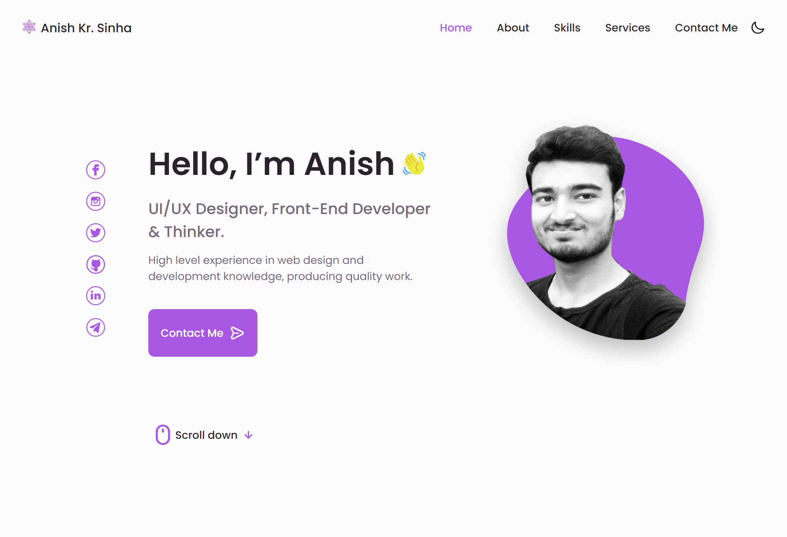

  

<h1 align="center">
  Portfolio Website
</h1>

  This page contains my Personal Portfolio website.🤓

 

  

  
Thank you for being here! ✨ 
You can see this project live [here](https://SinhaAnishKumar.github.io/)
 Stalking Not Prohibited!😁
 Page Designed By @SinhaAnishKumar.💖
 

 
Yes, you can fork this repo.😊

You can find my other project **[here](https://github.com/SinhaAnishKumar?tab=repositories)**.💻
 

 

  

 Let's Have A Chat On ❤ 
 

	
	
	
	
	
	

